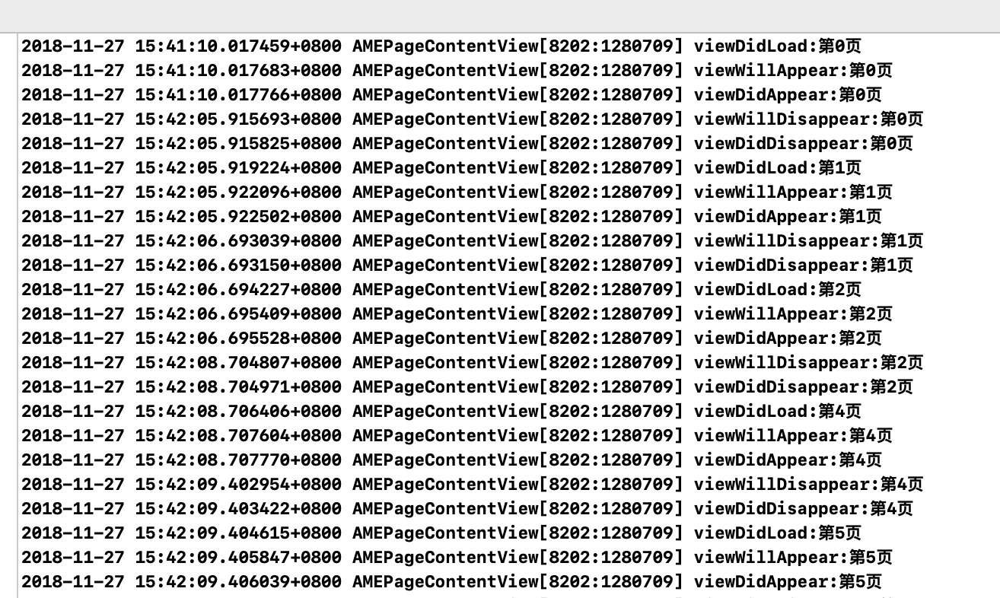

# AMEPageContentView
A page content view for iOS


#####  Chinese (Simplified): [中文说明](README_chs.md)

# What is this?
Just see the display image:


# Characteristics

1. lazyLoad
2. automic child viewcontroller life circle


3. xib or code init both OK

# How To use?

Supported properties:

```
//The necessary
self.contentView.fatherViewController = self;
self.contentView.itemArray            = self.itemArray;

//optional
self.contentView.canScroll            = YES;
self.contentView.buttonWidth          = 100;
self.contentView.underLineLenth       = 100;
self.contentView.underLineHeight      = 2;
self.contentView.chooseViewHeight     = 60;
self.contentView.selectedColor        = [UIColor orangeColor];
self.contentView.notSelectedColor     = [UIColor greenColor];
self.contentView.underLineColor       = [UIColor orangeColor];
self.contentView.delegate             = self;
```

### DO NOT FORGET

add this method to father viewcontroller
```
- (BOOL)shouldAutomaticallyForwardAppearanceMethods{
return NO;
}
```

# Install
```
pod 'AMEPageContentView', '~> 1.0'
```
```
#import <AMEPageContentView.h>
```


