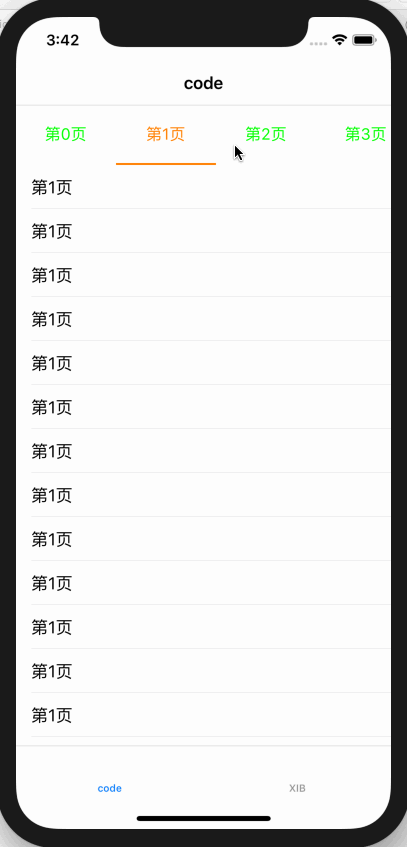
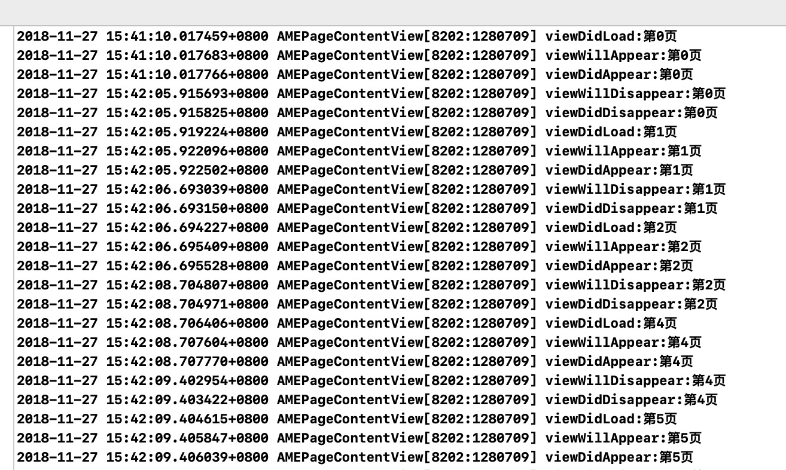

# AMEPageContentView
一个分页控制器


# 这是啥?
写了一个分页控制器
效果如图:<br>


# 特色

1. 懒加载 节约网络资源
2. 自动调用child viewcontroller 的life circle 如图


3. 支持纯代码和xib初始化

# 咋用?

有这么多属性:

```
//必须的
self.contentView.fatherViewController = self;
self.contentView.itemArray            = self.itemArray;

//选用
self.contentView.canScroll            = YES;
self.contentView.buttonWidth          = 100;
self.contentView.underLineLenth       = 100;
self.contentView.underLineHeight      = 2;
self.contentView.chooseViewHeight     = 60;
self.contentView.selectedColor        = [UIColor orangeColor];
self.contentView.notSelectedColor     = [UIColor greenColor];
self.contentView.underLineColor       = [UIColor orangeColor];
self.contentView.delegate             = self;
```

### 这里注意一下

在父viewcontroller加这个方法
```
- (BOOL)shouldAutomaticallyForwardAppearanceMethods{
  return NO;
}
```

# 安装

```
pod 'AMEPageContentView'
```
```
#import <AMEPageContentView.h>
```


